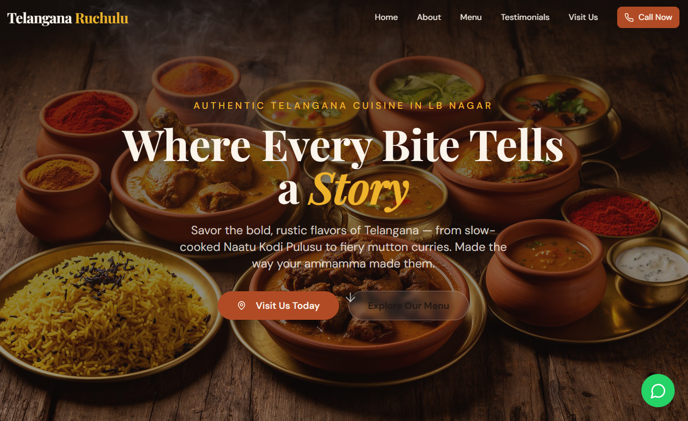
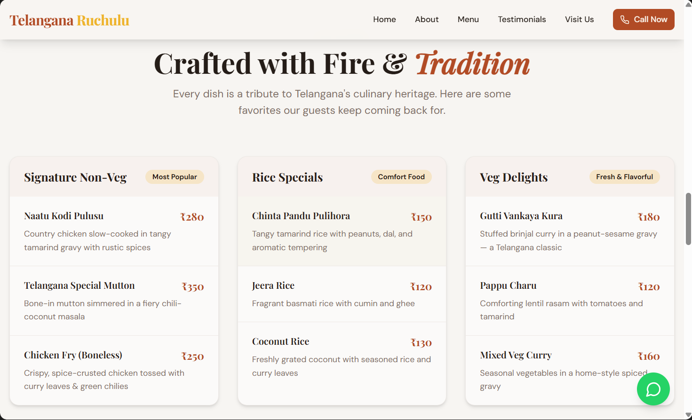
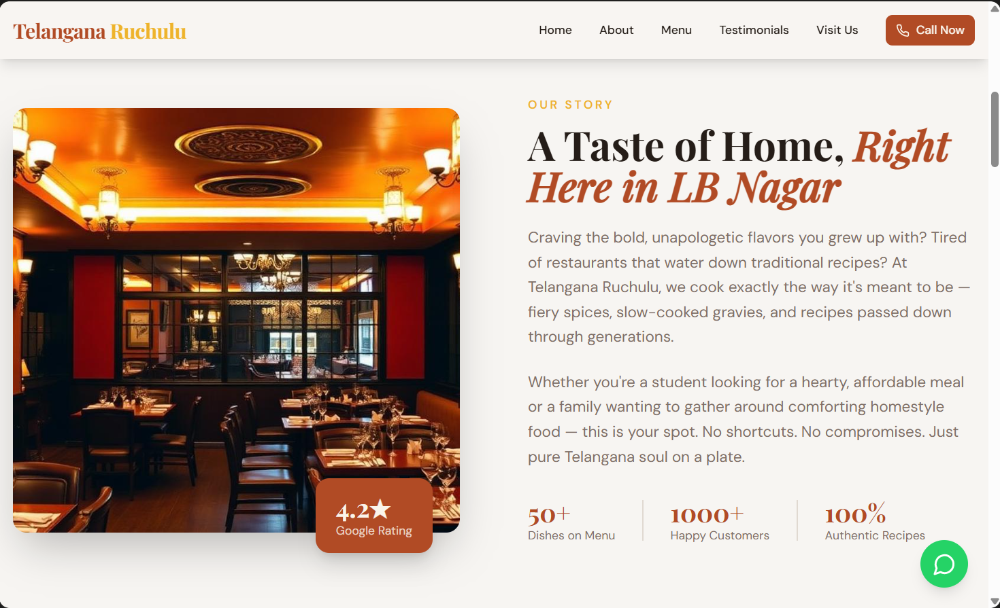
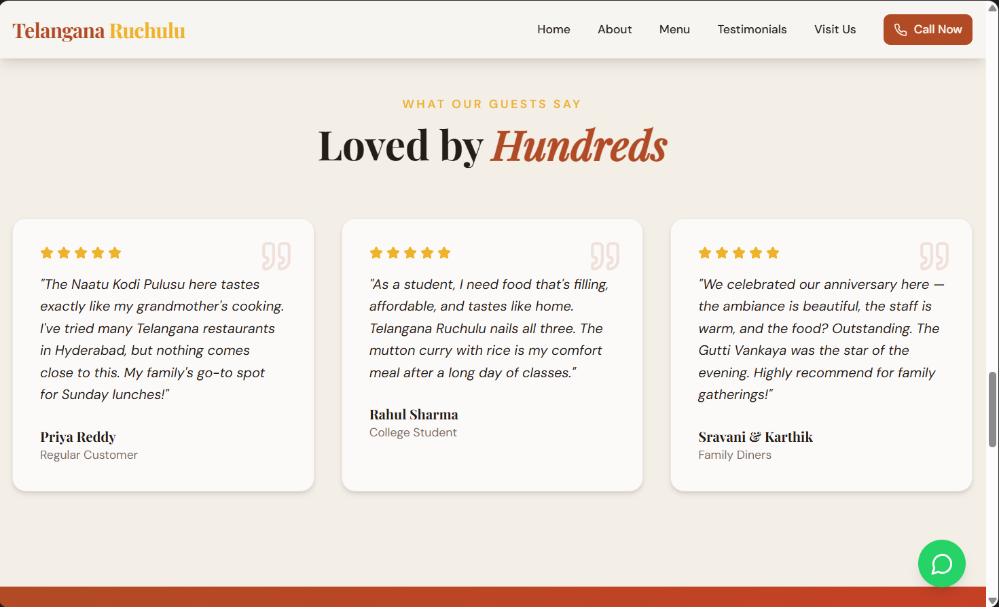
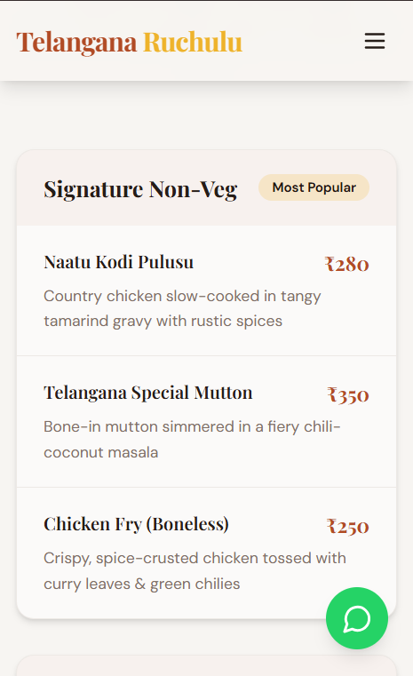
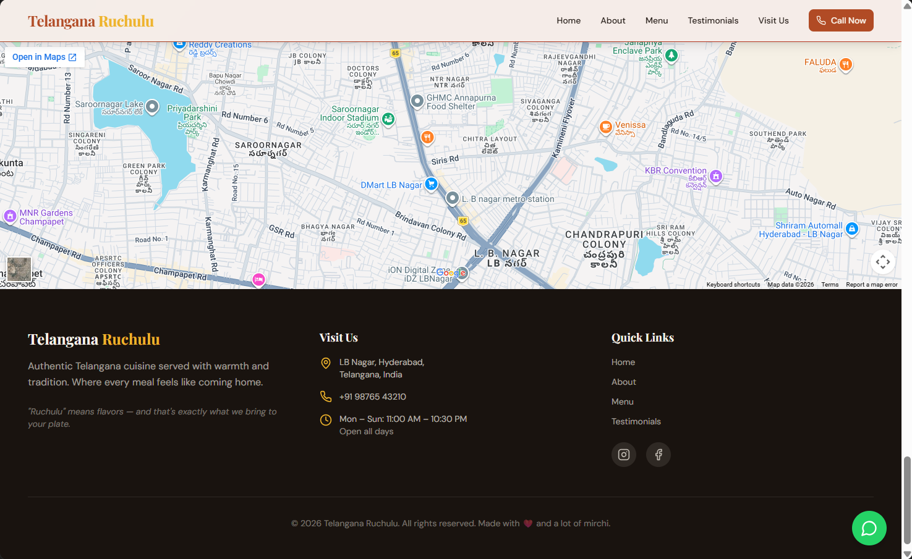

# 🍛 Telangana Ruchulu — Restaurant Website

> **Authentic Telangana flavors, served fresh in LB Nagar, Hyderabad.**
>
> A modern, conversion-focused single-page website built with React, Vite, Tailwind CSS, and Framer Motion — generated using AI-assisted prompts on Lovable.

---

## 🎬 Demo Video

> _Click the thumbnail below to watch the walkthrough._

[](docs/demo/telangana-ruchulu-demo.mp4)

📁 **Local file:** `docs/demo/telangana-ruchulu-demo.mp4`
🌐 **Live preview:** https://id-preview--4fe315e1-a1bb-4a7d-a350-4cfdc4364c85.lovable.app

---

## 🖼️ Screenshots

| Hero Section | Menu Section |
|---|---|
|  |  |

| About & Why Choose Us | Testimonials & CTA |
|---|---|
|  |  |

| Mobile View | Footer & Map |
|---|---|
|  |  |

> 📌 _Place your screenshots inside `docs/screenshots/` using the filenames above._

---

## 🏪 The Business

**Telangana Ruchulu** is a family-run restaurant in LB Nagar, Hyderabad, specializing in bold, authentic Telangana cuisine. Signature dishes include **Naatu Kodi Pulusu**, **Telangana Special Mutton Curry**, and **Gutti Vankaya Kura**.

- **Audience:** Students & families
- **Positioning:** Premium-yet-affordable, heritage-driven, fiery local flavors
- **Goal of the site:** Drive walk-ins, calls, and directions clicks

📍 [View on Google Maps](https://maps.google.com/?cid=9907263419469612305)

---

## 🧠 Prompt Logic

The website was generated using a **structured, role-based prompt** that combined three expert personas: _copywriter_, _UI/UX strategist_, and _conversion specialist_.

### Prompt Structure

```
ROLE         → Expert copywriter + UX strategist + CRO specialist
CONTEXT      → Business name, type, location, audience, USPs
TASK         → Generate complete website content + design direction
CONSTRAINTS  → No generic content, ready-to-publish, conversion-focused
OUTPUT       → Sectioned markdown (Hero, About, Menu, Testimonials, CTA, Footer)
```

### Why this structure works

1. **Role priming** anchors the model in the right expertise.
2. **Concrete business inputs** (name, location, USPs) eliminate hallucinations.
3. **Explicit constraints** ("no generic content") push for specificity.
4. **Output format** makes it directly usable in a builder like Lovable.

The full prompt is stored in [`prompts/website-generation.md`](prompts/website-generation.md).
The raw AI output is preserved in [`outputs/generated-content.md`](outputs/generated-content.md).

---

## 🛠️ Tools Used

| Tool | Purpose |
|---|---|
| **Lovable** | AI app builder — generated the full React site from prompts |
| **React 18 + Vite 5** | Frontend framework & build tool |
| **TypeScript** | Type safety |
| **Tailwind CSS v3** | Utility-first styling + design tokens |
| **shadcn/ui** | Accessible component primitives |
| **Framer Motion** | Scroll & entrance animations |
| **Lucide Icons** | Icon set |
| **Google Fonts** | Playfair Display + DM Sans |

---

## 📁 Project Structure

```
.
├── docs/
│   ├── demo/              # Demo video
│   └── screenshots/       # README screenshots
├── prompts/               # Structured prompts used to generate the site
├── outputs/               # Raw AI-generated content
├── src/
│   ├── assets/            # Hero & interior images
│   ├── components/        # Navbar, Hero, About, Menu, Testimonials, CTA, Footer
│   ├── pages/             # Index (single-page site)
│   └── index.css          # Design tokens (HSL semantic colors)
├── tailwind.config.ts     # Theme extensions
└── README.md
```

---

## 🚀 Run Locally

```bash
# 1. Clone
git clone <your-repo-url>
cd telangana-ruchulu

# 2. Install
bun install        # or: npm install

# 3. Dev server
bun run dev        # or: npm run dev

# 4. Build
bun run build
```

App runs on `http://localhost:8080`.

---

## 🎨 Design System

All colors are defined as **HSL semantic tokens** in `src/index.css` and exposed via Tailwind in `tailwind.config.ts`:

| Token | Use |
|---|---|
| `--primary` (terracotta) | Buttons, headlines, brand |
| `--accent` (turmeric gold) | CTAs, highlights |
| `--warm-dark` | Footer & dark sections |
| `--spice-red` | Gradient overlays |

Typography pairs **Playfair Display** (display) with **DM Sans** (body) for an editorial-meets-modern feel.

---

## ✅ Conversion Features

- 📞 Sticky **Call Now** button in navbar
- 💬 Floating **WhatsApp** button (bottom-right)
- 📍 **Get Directions** CTA linked to Google Maps
- ⏰ Scarcity banner ("Weekend Special — 10% off")
- ⭐ Social proof via testimonials
- 🗺️ Embedded Google Map in footer

---

## 📜 License

MIT — feel free to fork and adapt for your own local business.

---

_Made with ❤️ and a lot of mirchi 🌶️_

---

AI-assisted React + Tailwind restaurant website with modern UI, animations, and conversion-focused design
